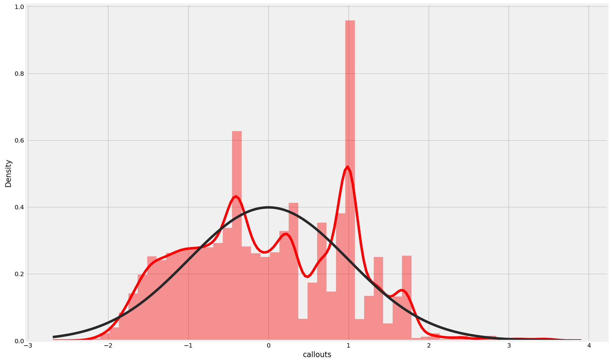
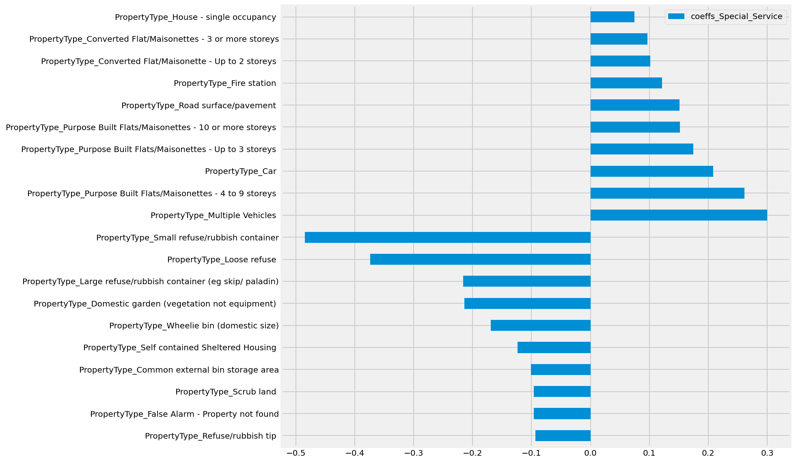

# How Many Fire Engines Next Week?:  Using Weather Data to Predict London Fire Brigade Callouts

Using data provided by the London Fire Brigade (LFB) and the Met Office, I analysed LFB callouts in relation to the weather to predict and classify callouts. :firefighter: :firefighter: :firefighter: 

## Table of Contents
* [Project Goals](#project-goals)
* [Data Sources](#data-sources)
* [Data Preparation and EDA](#data-preparation-and-eda)
* [Time Series and Regression Modelling](#time-series-and-regression-modelling)
* [Callout Prediction](#callout-prediction)
* [Classification Modelling](#classification-modelling)
* [Next Steps](#next-steps)

## Project Goals
The London Fire Brigade is the largest in the world and has 100,000 callouts per year. Weather has a significant effect on ambulance and police callouts (people don’t riot when it’s raining and respiratory emergencies increase with temperature). I wanted to predict callout numbers for the next week based on the current weather forecast. In addition, a first look at the data showed that over half the callouts are false alarms so I wanted to see if a classification approach could be useful to predict a false alarm. Successful prediction results will be useful for resource planning and successful classification results may be useful for helping to reduce false alarms (over half the callouts are false alarms). The map below gives an idea of the scope of the project.  

**Predictions:** Predicting number LFB callouts in the short term and likely classification of callout.  
**Goals:** Reveal which features have the most influence on callout numbers and callout classification.  

## Data Sources
* [LFB Incidents](#LFB-Incidents-)
* [London Boroughs](#London-Boroughs-)
* [Hourly Weather to 2019](#Hourly-Weather-to-2019-)
* [Hourly Weather 2020](#Hourly-Weather-2020-)
* [Sunrise and Sunset Times](#Sunrise-and-Sunset-Times-)
* [Actual and Forecast Weather](#Actual-and-Forecast-Weather-) 

#### LFB Incidents  
[London Datastore LFB Incidents](https://data.london.gov.uk/dataset/london-fire-brigade-incident-records). The London Datastore is an open portal with a lot of information about London (well worth a look). 2 csv files from here listing all LFB callouts from 2013-2016 and 2017-2020.  

---

#### London Boroughs  
[London Datastore Borough Boundaries](https://data.london.gov.uk/dataset/statistical-gis-boundary-files-london). A collection of shape files from here for use with GeoPandas (and contextily) for the map above.  

---

#### Hourly Weather to 2019  
[Met Office Archives](https://catalogue.ceda.ac.uk/uuid/dbd451271eb04662beade68da43546e1). CEDA MIDAS open datasets of hourly records from Met Office weather stations across the UK (including Heathrow). 12 csv files from here (3 per year for different readings).  

---

#### Hourly Weather 2020  
[Meteostat](https://github.com/meteostat). A very useful python friendly archive dataset of worlwide weather readings (with a github page and easy API), needed for the 2020 weather data (and filling in gaps for the other years). The data needed some feature engineering to match the Met Office data.  

---

#### Sunrise and Sunset Times  
[Earth System Research Laboratories](https://www.esrl.noaa.gov/gmd/grad/solcalc/calcdetails.html) A spreadsheet to download to calculate the official sunrise and sunset times anywhere on earth over a calendar year.  

---

#### Actual and Forecast Weather  
[Met Office Forecast London](https://www.metoffice.gov.uk/weather/forecast/gcpvj0v07#?). This webpage (which was scraped for the data) gives the current forecast for the rest of today and the following six days for London.  
[Met Office Actual Heathrow](https://www.metoffice.gov.uk/weather/forecast/gcpvj0v07#?). This webpage (also scraped) gives an additional variable (air pressure) used for the callout predictions.  

---

## Data Preparation and EDA 
* [Preparation](#preparation-)
* [Time Series and Regression EDA](#time-series-and-regression-eda-)
* [Classification EDA](#classification-eda-)

#### Preparation  
The 2 LFB files have slightly different columns and format.They were joined, reformatted (inc datetime index) for all incidents 2016-2019 inclusive with non-relevant columns dropped. Weekend, holiday and lockdown columns added.
The 12 Met Office csv files (hourly weather 2016-2019) were joined and reformatted (inc datetime index) with non-relevant columns dropped. The 1 Meteostat file (2020 with features engineered to match Met Office features) joined. Weather data in GMT, LFB data in GMT/BST so weather data adjusted to suit. ‘Islight’ column added from calculated sunrise/sunset times.
LFB and weather data joined and weather data padded/backfilled appropriately. The final step at this stage was to feature engineer a column to take account of low temperatures on the assumption that a cold spell is likely to cause more callouts. This was done by creating a coumn of (air temperature-13 )**2, so that low temperatures could be positively correlated with callout numbers.  

---

#### Time Series and Regression EDA  

I wanted to predict on callout numbers per hour so I needed to aggregate the data by hour to create callout counts per hour, resulting in a dataframe with 43498 rows. In addition, a column was feature engineered showing the prior year callout counts at the same hour (also meaning that the 29th  Feb dates needed to be dropped). The next step was to look at the data in more detail. Firstly looking at the counts over time. This chart clearly shows the annual seasonality (along with interesting spikes in Feb/Mar 2018 during a cold spell and June 2018 during a heatwave).  
  

Next looking at the mean callouts per hour over the whole period, we clearly see a daily seasonality (not many calls at 4 in the morning, with a peak in the early evening).  
  

Looking at the heatmap of correlations between the continuous variables, we can see that there are some variables correlated with the target variable (callouts) and no significant multicollinearity between the predictor variables.  
  

Seeing the daily and annual seasonality, the first step was to explore the time series aspects of the data. initially looking at the autocorrelation and partial autocorrelation plots, where we can see a strong autocorrelation with the hour of the day.  
  

---

#### Classification EDA  

Switching to the classification task (where we are looking at 3 different classes: Fire, Special Services and False Alarm), I looked at pairplots of relevant variables, where we can see no obvious clusters.  
  

However, there is an additional variable (PropertyType, 286 distinct types) which wasn't used for the callout predictions which is worth looking at. Here are the counts for the top  50 types of property.  
  

## Time Series and Regression Modelling
* [Time Series](#time-series-)
* [Regression](#regression-)

### Time Series  
Seeing the annual seasonality, initially I tried a pure time series SARIMA model. However, trying with an annual seasonality and hourly time periods was too much of a stretch for my available processing and memory resources, so I tried a SARIMAX model including the prior year counts an an exogenous variable along with the weather variables. This resulted in an R2 score of 0.52213. This was a useful reference, but there were 2 issues meaning that I wouldn't go further with the SARIMAX modelling: 1) the lack of availability of callout data after the end of December 2020 meant I wouldn't be able to use the model for current predictions and 2) this wasn't a cross-validated score.  

### Regression
* [Linear Regression](#linear-regression-)
* [Other Models](#other-models-)

#### Linear Regression  
GridSearching a regularised (ElasticNet penalty) Linear Regression model gave the best and most interpretable results:  
* Linear Regression (alpha = 0.0024, l1-ratio = 0.775)  
-Training Score: 0.5202  
-Test Score: 0.5199  
-CV Score: 0.5186  

---

Looking at the predictions against actual:  
  

---
Looking at the distribution of the standardised residuals against a normal distribution:  
  

We can see that there is useful predictive information from the model, although with a significant amount of unexplained variance (more investigation required!).  

---

I also divided the process into 2 steps (using the same model parameters) - firstly modelling using the time variables only (CV score 0.4997) and then using the residuals from this model as the target for the weather variables (CV Score 0.05667) in order to see the relative importance of the time against the weather and also to separate the various feature importances. We can see from the cross-validated scores that the time has much more significant predictive information than the weather, but the weather does have some predictive information.  
* Time Feature Importances:  
  
 

* Weather Feature Importances:  
  

#### Other Models  

I tried a number of other regression modelling approaches, with the cross-validated scores listed below:  
* Linear Regression (Power Transformer rather than Standard Scaler) - CV Score 0.5159.  

* Linear Regression (Polynomial Features degree 2) - CV Score 0.5151 

* Decision Tree Regression (GridSearched) - CV Score 0.4183  

* Bagging Decision Tree Regressor - CV Score 0.5065  

* Random Forest Regressor - CV Score 0.5067  

* ADA Boost Regressor - CV Score 0.5103  

* SGD Regressor - CV Score 0.5184  

* SVM Regressor - CV Score 0.5085  

* NNet Regressor - CV Score 0.4639  

---

## Callout Prediction  
Below is a sample callout prediction for the following 6 full days, produced by running the code in the prediction script (predictionscript.py in the repo). This code scrapes the 2 Met Office webpages, extracts the data and feature engineers weather columns to match the linear regression model above, adds other feature engineered columns, imports the model and creates  prediction. Note the daily seasonality combined with weather variation overlaid.  
  

## Classification Modelling
For all of the modelling, the baseline from the data was:  
Baseline Values  
-False Alarm: 	  0.5022  
-Special Service: 0.3138  
-Fire: 		  0.1840  

* [Logistic Regression](#logistic-regression-)
* [Other Models](other-models-)

#### Logistic Regression  
Gridsearching a multinomial regularised (l2 penalty) logistic regression model gave the best and most interpretable results:  
* Logistic Regression (C = 0.01)  
-CV Score: 0.6584  

This is significantly better than baseline. Further metrics for the results are shown below (all looking at the test data):  

* Confusion Matrix  
  

* Precision-Recall Curves  
  

* Receiver Operating Characteristic Curves  
  

---
In addition, we insight into what factors are associated with False Alarms, Special Service Calls and Fire Calls are given by the coefficients of the models for each of the classes, the most important of which are shown below (the most imposrtant coefficients in the centre of each chart):  

* False Alarm Coefficients  
  

* Special Service Coefficients  
  

* Fire Coefficients  
  

---

